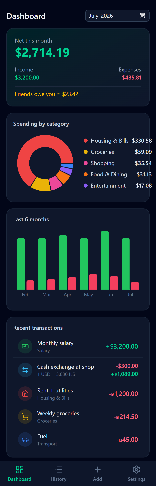

# 💸 Expense Tracker

> ⚠️ **This project is entirely vibe-coded.** It was built by describing features to an AI assistant rather than hand-written, and does not represent my own coding expertise.

A personal expense & income tracker built as a **Progressive Web App** — install it on your phone's home screen and it looks and feels like a native app, with no App Store required. Data syncs across devices through a free Supabase backend, and the app keeps working offline.

**Live app:** https://expense-tracker-seven-psi-42.vercel.app

<p align="center">
  
</p>

## Features

### 📊 Dashboard
- Monthly **net / income / expenses** summary, browsable month by month
- **Spending by category** donut chart
- **Last 6 months** income vs. expense bar chart
- Recent transactions at a glance
- Everything is converted into your chosen **base currency** for totals

### 💱 Multi-currency & exchanges
- Record any transaction in any currency (USD, ILS, EUR, ... — add your own)
- **Exchange transactions**: log converting cash at a shop or transferring between currency accounts (e.g. *give 200 USD → receive 710 ILS*)
- The exchange rate **prefills from live market rates but is fully overridable** — because the rate the shop gives you is never quite the market rate
- **Live exchange rates** fetched on demand from [open.er-api.com](https://www.exchangerate-api.com) (free, no API key), editable manually anytime

### 🧾 Split bills
- Paid for the whole table but only part was yours? Enter the **total paid** and **your share**
- Only your share counts as an expense; the rest is tracked as **"friend owes you"**
- The dashboard shows the running total owed to you; one tap marks a debt repaid

### ☁️ Cloud sync & backup
- Optional **email + password account** (Supabase) — log in on your phone and laptop and every change syncs automatically within seconds
- **Offline-first**: the app works with no connection and catches up when you're back online
- Sync is last-write-wins with pull-on-focus, so devices converge quickly
- **Export / Import**: download all data as a JSON file and restore it anywhere — works even without an account

### 📱 PWA
- **Add to Home Screen** on iOS/Android → fullscreen standalone app with its own icon
- Service worker precaches the app so it opens instantly
- Safe-area aware (content doesn't hide behind the iPhone notch/status bar)

## How to use

1. **Open the app** (or your own deployment) in your phone's browser
2. **Install it**: Safari → Share → *Add to Home Screen* (Chrome on Android: ⋮ → *Add to Home screen*)
3. **Add transactions** with the ➕ tab:
   - **Expense** — pick a category, amount, currency, date, and an optional name. Toggle *Split bill* if a friend owes you part of it.
   - **Income** — salary, freelance, gifts...
   - **Exchange** — moving money between currencies. Set the real rate you got, or tap *Use market rate*.
4. **History** tab: search by name, filter by type or category, delete entries, mark split bills repaid
5. **Settings** tab:
   - Log in to enable cross-device **cloud sync**
   - Set your **base currency** and manage currencies/rates (*Fetch live rates* updates them all)
   - Manage income/expense **categories** (custom icons & colors)
   - **Export/Import** backups

## Tech stack

| Layer | Choice |
|---|---|
| UI | React 19 + TypeScript, Tailwind CSS v4, lucide-react icons |
| Charts | Recharts |
| Build / PWA | Vite, `vite-plugin-pwa` (Workbox service worker) |
| Data | localStorage (offline source of truth) + Supabase (auth & sync) |
| Hosting | Vercel |

## Running locally

```bash
npm install
npm run dev      # dev server at http://localhost:5173
npm run build    # production build (includes service worker)
```

The app works fully without any backend — data just stays in the browser.

## Setting up your own cloud sync

1. Create a free project at [supabase.com](https://supabase.com)
2. In the **SQL Editor**, run:

   ```sql
   create table public.user_data (
     user_id uuid primary key references auth.users (id) on delete cascade,
     payload jsonb not null,
     updated_at timestamptz not null default now()
   );

   alter table public.user_data enable row level security;

   create policy "Users manage own data" on public.user_data
     for all
     using (auth.uid() = user_id)
     with check (auth.uid() = user_id);
   ```

3. Put your project URL and anon key in [`src/lib/supabase.ts`](src/lib/supabase.ts) (the anon key is public by design — row-level security keeps each user's data private)
4. Optionally, in **Authentication → Sign In / Up → Email**, disable *Confirm email* for instant account creation

## How sync works

- All data lives in `localStorage`, so the app is always fast and works offline
- When logged in, every change is **pushed** to Supabase (debounced ~1s) as a single JSON snapshot per user
- When the app opens or regains focus it **pulls** the cloud copy — unless local changes are newer, in which case it pushes instead (last-write-wins via change timestamps)
- Logging out keeps local data on the device

## Deploying

```bash
npx vercel deploy --prod
```

Any static host works (Netlify, GitHub Pages, ...) — it's a fully static build. The app uses hash-based routing, so no server rewrites are needed.
